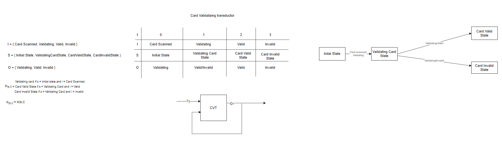
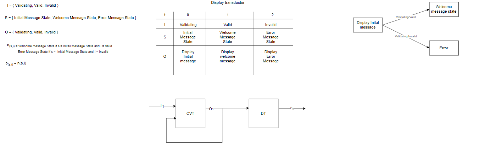
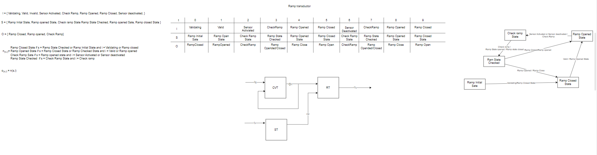
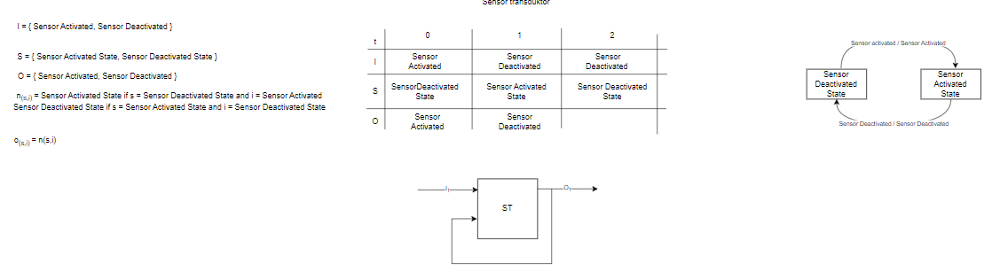
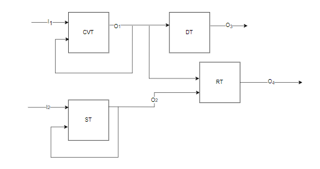

## **Dijagram stanja**

U donjoj slici je prikazan dijagram stanja simulatora rampe

**prikaz transduktora validacije**

**prikaz transduktora prikaza**

**prikaz transduktora rampe**

**prikaz transduktora senzora**

**prikaz transduktora sustava**

